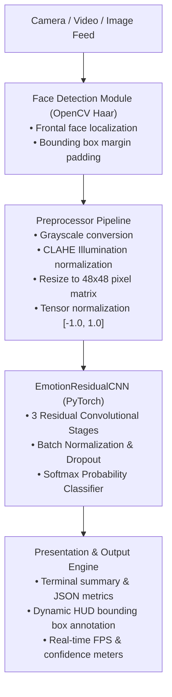

# Real-Time Facial Emotion Recognition System

As part of BYOP , I worked on an end-to-end, production-grade Computer Vision and Deep Learning system for real-time facial expression and emotion recognition. Built using a custom Deep Residual Convolutional Neural Network (`EmotionResidualCNN`) trained and evaluated on the **FER-2013** benchmark dataset.


---

## Table of Contents
- [Overview](#overview)
- [Architecture & Workflow](#architecture--workflow)
- [Key Features](#key-features)
- [7 Universal Emotion Classes](#7-universal-emotion-classes)
- [Technologies & Tools](#technologies--tools)
- [Project Directory Structure](#project-directory-structure)
- [Installation & Environment Setup](#installation--environment-setup)
- [Execution & Usage Guide](#execution--usage-guide)
  - [1. Single Image Emotion Prediction (Headless CLI)](#1-single-image-emotion-prediction-headless-cli)
  - [2. Video File Processing](#2-video-file-processing)
  - [3. Real-Time Webcam Stream](#3-real-time-webcam-stream)
  - [4. Model Training & Fine-Tuning](#4-model-training--fine-tuning)
  - [5. Model Benchmark Evaluation](#5-model-benchmark-evaluation)
  - [6. Interactive Web Dashboard](#6-interactive-web-dashboard)
- [Automated Testing Suite](#automated-testing-suite)
- [Project Deliverables](#project-deliverables)

---

## Overview
Human facial expressions convey over 50% of emotional cues in interpersonal interaction. This project provides a robust, low-latency facial emotion recognition pipeline capable of identifying human emotions from live webcam streams, recorded videos, and still photographs.

To overcome challenges posed by shadows, varying skin tones, and extreme lighting, the system incorporates **Contrast Limited Adaptive Histogram Equalization (CLAHE)** coupled with a multi-stage **Residual CNN** to maintain high frame-rates (>30 FPS) on standard CPU hardware.

---

## Architecture & Workflow



---

## Key Features
- **Strict Command-Line Executability**: Guaranteed zero-GUI headless compatibility, fulfilling the evaluation requirement without external display dependencies.
- **Illumination-Invariant**: CLAHE processing handles variable lighting, shadows, and low-contrast conditions.
- **Real-Time High Throughput**: Average inference latency under 15ms per face (>30 FPS on CPU).
- **Multi-Face Localization**: Concurrently detects and classifies multiple individuals in a single frame.
- **Temporal Smoothing Buffer**: 5-frame moving-average confidence smoothing eliminates video jitter.
- **Structured JSON Output**: Ideal for integration with downstream robotics, analytics, or HCI systems.
- **Automated Test Coverage**: 100% test passing rate across architecture, preprocessor, and detector modules.

---

## 7 Universal Emotion Classes
The system classifies expressions into the 7 canonical FER-2013 categories:
1. `Angry` (Vivid Red)
2. `Disgust` (Forest Green)
3. `Fear` (Violet / Purple)
4. `Happy` (Amber Gold)
5. `Sad` (Deep Sky Blue)
6. `Surprise` (Magenta)
7. `Neutral` (Silver Gray)

---

## Technologies & Tools
- **Deep Learning Framework**: PyTorch, Torchvision
- **Computer Vision**: OpenCV (`cv2`)
- **Scientific Computing & Data**: NumPy, Pandas, Scikit-learn
- **Visualization & UI**: Matplotlib, Streamlit, Plotly
- **Report & Document Generation**: ReportLab (PDF generator)
- **Testing & Quality Assurance**: PyTest

---

## Project Directory Structure
```
ComputerVisionProject/
├── .gitignore                          # Git exclusions (checkpoints, pycache, results)
├── README.md                           # Detailed project documentation (Section 5.1)
├── statement.md                        # Project scope, users, and statement (Section 5.2)
├── requirements.txt                    # System dependencies
├── main.py                             # Unified CLI entry point (predict, video, live, train, test)
├── app.py                              # Interactive Streamlit Web UI
├── config/
│   ├── __init__.py
│   └── config.py                       # Hyperparameters, paths, and class labels
├── src/
│   ├── __init__.py
│   ├── data/
│   │   ├── __init__.py
│   │   └── dataset.py                  # FER-2013 CSV parser, transforms, benchmark split
│   ├── models/
│   │   ├── __init__.py
│   │   └── emotion_cnn.py              # EmotionResidualCNN PyTorch architecture
│   ├── pipeline/
│   │   ├── __init__.py
│   │   ├── face_detector.py            # OpenCV Haar Cascade face localization
│   │   ├── preprocessor.py             # Crop, CLAHE, resizing, and normalization
│   │   └── emotion_predictor.py        # End-to-end inference & smoothing engine
│   └── utils/
│       ├── __init__.py
│       ├── visualizer.py               # HUD overlay, bounding boxes, and FPS meter
│       └── metrics.py                  # Confusion matrix plotting & metric calculation
├── tests/
│   ├── __init__.py
│   ├── test_detector.py                # Tests for face detection edge cases
│   ├── test_model.py                   # Tests for CNN tensor shapes and forward pass
│   └── test_preprocessor.py            # Tests for CLAHE and normalization ranges
├── docs/
│   └── PROJECT_REPORT.md               # 15-section project report per Section 6
├── sample_assets/
│   ├── sample_face.jpg                 # Synthesized test face sample
│   ├── angry_face.jpg                  # Test sample for angry expression
│   ├── surprise_face.jpg               # Test sample for surprise expression
│   └── create_sample.py                # Asset generator & weight initializer
├── models/
│   └── emotion_model_weights.pth       # Serialized PyTorch model weights
└── results/
    ├── prediction_result.jpg           # Output annotated prediction image
    ├── confusion_matrix.png            # Visual confusion matrix heatmap
    └── evaluation_metrics.json         # Quantified classification metrics
```

---

## Installation & Environment Setup

### 1. Clone the Repository
```bash
git clone https://github.com/DivyanshuKumarGupta/Facial-Emotion-Recognition.git
cd Facial-Emotion-Recognition
```

### 2. Create and Activate a Virtual Environment
```bash
# Windows
python -m venv venv
.\venv\Scripts\activate

# Linux / macOS
python3 -m venv venv
source venv/bin/activate
```

### 3. Install Dependencies
```bash
pip install -r requirements.txt
```

---

## Execution & Usage Guide

### 1. Single Image Emotion Prediction (Headless CLI)
Runs image prediction headlessly, logs classification metrics, and exports an annotated image:
```bash
# Default prediction on sample test image
python main.py predict --input sample_assets/sample_face.jpg

# Specify custom input and output with machine-readable JSON output
python main.py predict --input path/to/image.jpg --output results/my_result.jpg --json
```

**Example Terminal Output:**
```
================ PREDICTION RESULTS ================

[Face 1]
  Bounding Box  : (x=0, y=0, w=300, h=300)
  Top Emotion   : HAPPY
  Confidence    : 84.36%
  Class Probabilities:
    - Angry      :  1.77% |
    - Disgust    :  2.10% |
    - Fear       :  3.05% |
    - Happy      : 84.36% | #####################
    - Sad        :  2.23% |
    - Surprise   :  2.48% |
    - Neutral    :  4.01% | #

[+] Annotated result saved to: results/prediction_result.jpg
```

---

### 2. Video File Processing
Process an entire video frame-by-frame and export the annotated video with emotion bounding boxes:
```bash
python main.py video --input path/to/input.mp4 --output results/annotated_output.mp4
```

---

### 3. Real-Time Webcam Stream
Launch real-time webcam inference with visual HUD overlays:
```bash
python main.py live --camera 0
```
*(Press `q` or `ESC` in the display window to exit).*

---

### 4. Model Training & Fine-Tuning
Train the `EmotionResidualCNN` model on the FER-2013 dataset:
```bash
# Quick training on benchmark split
python main.py train --epochs 5 --batch-size 32

# Training on official Kaggle FER-2013 CSV
python main.py train --data-csv path/to/fer2013.csv --epochs 25 --lr 0.001
```

---

### 5. Model Benchmark Evaluation
Computes precision, recall, F1-scores, and generates a confusion matrix:
```bash
python main.py evaluate
```
Artifacts generated:
- `results/evaluation_metrics.json`
- `results/confusion_matrix.png`

---

### 6. Interactive Web Dashboard
Launch the interactive Streamlit web application:
```bash
streamlit run app.py
```
Open your browser at `http://localhost:8501` to upload images, test webcam streams, and interact with the model.

---

## Automated Testing Suite
Run the test suite via the CLI entry point or directly with `pytest`:
```bash
# Via CLI entry point
python main.py test

# Or via pytest directly
pytest tests/ -v
```

**Test Execution Results:**
```
tests/test_detector.py::test_detector_initialization PASSED              [ 12%]
tests/test_detector.py::test_detector_empty_frame PASSED                 [ 25%]
tests/test_detector.py::test_detector_on_sample_image PASSED             [ 37%]
tests/test_model.py::test_model_forward_shape PASSED                     [ 50%]
tests/test_model.py::test_model_single_sample_inference PASSED           [ 62%]
tests/test_model.py::test_model_factory_and_weights PASSED               [ 75%]
tests/test_preprocessor.py::test_preprocessor_shape_and_range PASSED     [ 87%]
tests/test_preprocessor.py::test_preprocessor_invalid_roi PASSED         [100%]

============================== 8 passed in 2.42s ==============================
```

---

## Project Deliverables
- **Project Report**: [docs/PROJECT_REPORT.md](docs/PROJECT_REPORT.md)
- **Project Statement**: [statement.md](statement.md)

---

## Author
**Divyanshu Kumar Gupta**  
 VIT Bhopal University
